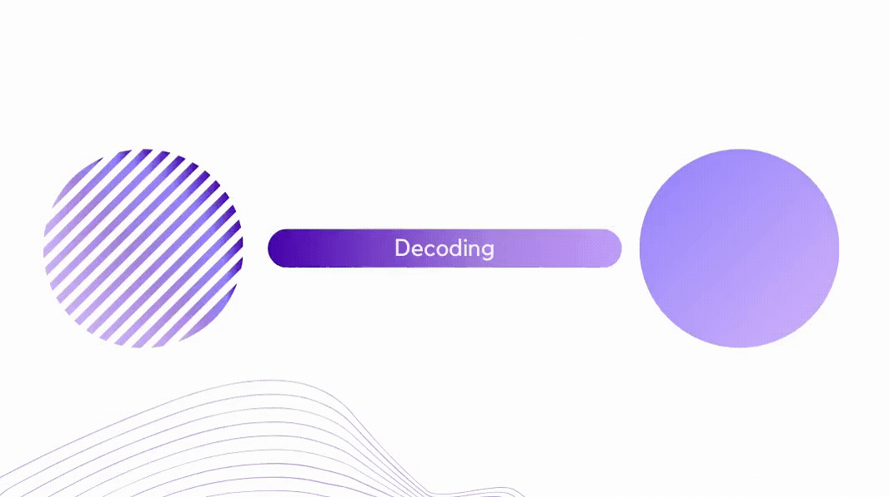

## Design




### Getting Started

```bash
$ cp .env.sample .env && yarn install
```

### Running in docker

```bash
# compiling docker compose
$ docker-compose -f docker/docker-compose.yml build

# running the stack
$ docker-compose -f docker/docker-compose.yml up -d

# get logs of the application
$ docker-compose -f docker/docker-compose.yml logs -f app

# run just the database
$ docker-compose -f docker/docker-compose.yml run --service-ports --detach db
```

### References & Inspiration:
* https://netflixtechblog.com/ready-for-changes-with-hexagonal-architecture-b315ec967749
* https://github.com/nubank/basic-microservice-example
