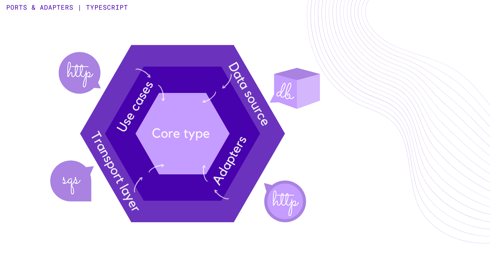

### Design



#### usecase
lorem

#### adapter
Adapters are responsible for converting the data between the outer layer
(http transport, storages, third party services, etc) and the inner layer
(use cases and core types). Data representations are converted through decoding/encoding.  
`core.adapter` is the main adapter which decodes any unknown data to core types.
Besides the core adapter, there is also the `storage.adapter`, which handles
data transport between database and the application. [See more about decoding here](http://google.com)

#### protocol
lorem

#### transport
lorem


### Getting Started

```bash
$ cp .env.sample .env && yarn install
```

### Running in docker

```bash
# compiling docker compose
$ docker-compose -f docker/docker-compose.yml build

# running the stack
$ docker-compose -f docker/docker-compose.yml up -d

# get logs of the application
$ docker-compose -f docker/docker-compose.yml logs -f app

# run just the database
$ docker-compose -f docker/docker-compose.yml run --service-ports --detach db
```

### References & Inspiration:
* https://netflixtechblog.com/ready-for-changes-with-hexagonal-architecture-b315ec967749
* https://github.com/nubank/basic-microservice-example
